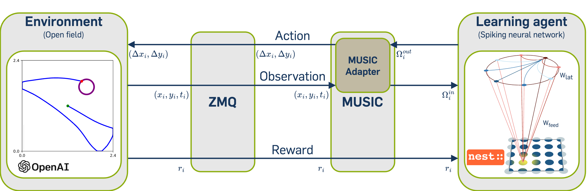
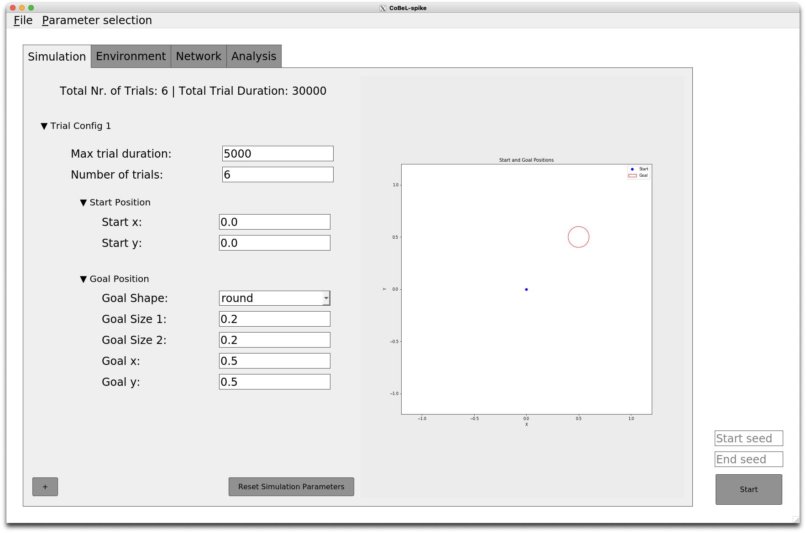

# CoBeL-spike

## Description

CoBel-Spike is a closed-loop simulator of complex behavior and learning based on spiking neural networks.  The CoBeL-spike tool-chain consists of three main components: the artificial agent, the environment, and a bidirectional interface between behavior and neuronal activity. The agent consists of a spiking neural network that receives sensory inputs and generates motor commands, which control the behavior of the agent in the simulated environment.


<div align="center">
  
  <p><em>Relationship between the components of the CoBeL-spike framework.</em></p>
</div>


## Table of Contents

- [Installation](#installation)
  - Manual Installation
  - Installation with Shell Script
  - Installation with Docker
  - High-Performance Computer (HPC) Usage
- [Using CoBeL-spike](#using-cobel-spike)
  - Running the simulation
  - Running the simulation with cpu and memory check
  - Running the analysis
  - Changing the parameters
  - GUI Usage
  - GUI Usage for Docker
- [Contributors](#contributors)
- [Publications](#publications)
- [License](#license)

## Installation

Step-by-step instructions on how to install CoBel-spike.
 
<details>
  <summary>Manual Installation </summary>

0- Make sure that all the dependencies are installed. Run
```bash
./install/check_packages.sh
```
to see if you have any missing dependencies. The currently supported versions of ubuntu are: 20.04, 22.04 and 24.04    

1- Creation of python environment:

Create a python environment using the `environment.txt`:

```bash
python3.8 -m venv <path_to_dependencies>/cobel
source <path_to_dependencies>/cobel/bin/activate
pip install pip==20.0.2 wheel==0.37.1 setuptools==44.0.0
pip install -r <path_to_repo>/install/environment.txt
```
2- Download MUSIC API from https://github.com/INCF/MUSIC and install is by following
the instructions provided in the README file there.

3- Download NEST simulator from https://github.com/nest/nest-simulator/releases/
and install it by following instructions
from https://nest-simulator.readthedocs.io/en/stable/installation/linux_install.html.
CoBeL-spike works with NEST versions <= 2.20.

Alternatively you can:

```bash
wget https://github.com/nest/nest-simulator/archive/v2.20.0.tar.gz
tar -xzvf nest-simulator-2.20.0.tar.gz
```

Make sure that you have all dependencies required installed (on top of the installation instruction webpage).
In addition, you should make sure that the configuration options for installing NEST is set correctly.
This means that you need to make sure that NEST has automatically found the path
to the python in the environment you have just created (you can check it out after configuring NEST
with `cmake`).

Moreover, the NEST should be configured with MPI and the MUSIC you installed in step 2. Go to the following link
https://nest-simulator.readthedocs.io/en/stable/installation/install_options.html
And look for how to connect NEST with MPI and MUSIC.
`cmake` is required to do this configuration. In the build directory run `cmake`
with the confiuration options as per instruction.
The following syntax can be used as an example:

```bash
$ cmake -DCMAKE_INSTALL_PREFIX:PATH=</install/path> </path/to/NEST/src> \ 
-Dwith-mpi=ON -Dwith-music=</path/to/MUSIC_install_dir>
```

Then compile and install NEST as per instruction.


4- Download and install MUSIC-adapters from https://github.com/bghazinouri/music-adapters.
The installation instruction is in README.rst. Make sure that you have all dependencies
required installed (you will find them on top of the installation instruction page).


5- Install the environment. Download the environment [here](https://github.com/bghazinouri/gym_env). After that you should execute the
following commands in your terminal:

```bash
$ cd <path_to_gym_env>/gym-openfield
$ pip install -e .
```

Make sure that you have activated the conda environment created in step 1.

6- You need to update gymz python package installed in step 1 to enable it so that it can deal with
environments that are not by default in openAIgym. To do so you need to download the updated version of
gymz from https://github.com/bghazinouri/python-gymz and run the following commands in
the terminal:

```bash
$ cd <path_to_unzipped_gymz>
$ pip install -e .
```

7- Path variables for NEST are already set in `nest_vars.sh` in
`<path/to/NEST_install dir>/bin`. You need to set the path variables for MUSIC
and MUSIC-adapters as well. One option is to edit `nest_vars.sh` file and add
these paths in there. For example*:

```bash
#!/bin/sh

# Activating the related conda environment
#/home/nest/miniconda3/bin/conda init
#exec bash
conda activate cobel-spike

# NEST is installed here. When you relocate NEST, change this variable.
export NEST_INSTALL_DIR=<path/to/NEST_install_dir>

# MUSIC is installed here.
export MUSIC_INSTALL_DIR=<path/to/MUSIC_install_dir>

# MUSIC adapters installed here.
export MUSIC_AD_INSTALL_DIR=<path/to/MUSIC-ADAPTERS_install_dir>

# NEST finds standard *.sli files $NEST_DATA_DIR/sli
export NEST_DATA_DIR=$NEST_INSTALL_DIR/share/nest

# NEST finds help files $NEST_DOC_DIR/help
export NEST_DOC_DIR=$NEST_INSTALL_DIR/share/doc/nest

# The path where NEST looks for user modules.
export NEST_MODULE_PATH=$NEST_INSTALL_DIR/lib/nest

# The path where the PyNEST bindings are installed.
export NEST_PYTHON_PREFIX=$NEST_INSTALL_DIR/lib/python3.8/site-packages

# The path where python-music bindings are installed.
export MUSIC_PYTHON=$MUSIC_INSTALL_DIR/lib/python3.8/site-packages

export PYTHONPATH=$NEST_PYTHON_PREFIX:$MUSIC_PYTHON:$PYTHONPATH

export LD_LIBRARY_PATH=$MUSIC_INSTALL_DIR/lib:$MUSIC_AD_INSTALL_DIR/lib

# Make nest / sli /... executables visible.
export PATH=$NEST_INSTALL_DIR/bin:$MUSIC_INSTALL_DIR/bin:$MUSIC_AD_INSTALL_DIR/bin:$PATH
```

8- Finally, you should execute `nest_vars.sh`:

```bash
$ source <path/to/NEST_install_dir>/bin/nest_vars.sh
```

9- To run the simulation:

```bash
$ cd <path_to_repo>/simulator
$ ./run_simulation.sh <first_rng_seed_number> <last_rng_seed_number>
```

This shell script receives first and last random number generators (rngs) as input
arguments and run the simulation for all rngs between these two (including the two).
With this random numbers generated in nest will be different from one to the other,
which can mimic e.g. variability across different agents.

\* Note that you should also activate the conda environment (`conda activate cobel-spike`).
Similar to the example above, one can add this environment activation command to the
`nest_vars.sh`, so that executing this file is sufficient for having all packages
ready for running the simulation.

**Note on how to clone a project from Git: Copy the http from Git and go to the desired folder in terminal. Then use-

```bash
$ git clone <http>
```

If required, provide the Git username and password.
</details>


<details>
  <summary>Installation with Shell Script</summary>
1- Clone this repository

2- Navigate to the install directory of this repository

3- Make sure that all needed dependencies are installed. Run
```bash
./check_packages
```
Install missing dependencies.

4- Run following script to install CoBeL-spike:
```bash
./install.sh
```
5- Activate the virtual enviorenment and source the path variables in the *simulator* directory of this repository:
```bash
source source_paths.sh
```
You have to run this command in every new terminal session or add this command in the bashrc.

</details>


<details>
  <summary>Installation with Docker</summary>

1- Install Docker  
Download and install Docker. Instructions how to install docker are provided in the following
link: https://docs.docker.com/get-docker/ .

2- Create the image  
In order to get a working docker container you need the docker image for CoBeL-spike. Get this repository and run the following command in this directory.

```bash
$ docker build -t cobel-spike -f install/Dockerfile .
```

3- Create the container  
The following steps show how to create the container from the image build previously. 3.1 shows how to create an
interactively container which you can use like your terminal. If you don't need an interactively container and just want
to run a single command inside a container follow the steps provided with 3.2.

3.1- Create an interactively container  
The following command creates and runs an interactively container from the image cobel-spike.

```bash
$ docker run -it --name=cobel-spike-container cobel-spike /bin/bash
```

In order to exit the container type.

```bash
$ exit
```

To reuse this container use the following command. Make sure the container is running before trying to access the
container again. See *5- Managing the images and containers* for more info.

```bash
$ docker exec -it cobel-spike-container /bin/bash
```

3.2- Run a single job inside a container  
To create a container from the image cobel-spike which perfoms a single task run the following command inside your
terminal.

```bash
$ docker run --workdir=path/to/the/working/directory --name=nameOfTheContainer cobel-spike COMMAND 
```

The workdir option specifies the directory of the container and is optional. With the name option you give the container
a name. This option is as well optional but recommended in order to manage the different containers better.
Check https://docs.docker.com/engine/reference/run for more options. In COMMAND you can specify any command.  
In the following is an example how to run the simulation.

```bash
$ docker run --workdir=/cobel-spike/environment --name=cobel-spike_job_1_1 cobel-spike ./run_simulation.sh 1 1
```

4- Get data from the container  
To transfer any data from the container to the host system use the following command.

 ```bash
 $ docker cp CONTAINER:path/container path/host
 ```

To transfer the results from simulation from the container cobel-spike-container to your current host directoy use the
following command.

 ```bash
 $ docker cp cobel-spike-container:/cobel-spike/data . 
 ```  

5- Managing the images and containers

```bash
#List all images
$ docker images

#List all containers
$ docker container ls -a 

#List running containers
$ docker container ls

#Start a container
$ docker start CONTAINER

#Stop a container 
$ docker stop CONTAINER

#Remove an image
$ docker image rm IMAGE

#Remove a container
$ docker rm CONTAINER
```  

</details>

<details>
  <summary> High-Performance Computer (HPC) Usage </summary>

Here we provide the instructions on how to compile and use this system on a HPC.
The modules and versions provided here are based on the state of CNS HPC on
18.08.2020. The scheduling system on the HPC is SLURM and the commands for loading
modules, specifying resources in the job description and commands for submitting,
monitoring and etc. is based on SLURM (https://slurm.schedmd.com/overview.html).

1- Loading the necessary modules:

```bash
$ module load GCCcore/7.3.0 binutils/2.30-GCCcore-7.3.0 GCC/7.3.0-2.30 \ 
numactl/2.0.11-GCCcore-7.3.0 XZ/5.2.4-GCCcore-7.3.0 zlib/1.2.11-GCCcore-7.3.0 \
libxml2/2.9.8-GCCcore-7.3.0 libpciaccess/0.14-GCCcore-7.3.0 hwloc/1.11.10-GCCcore-7.3.0 \
OpenMPI/2.1.2-GCC-7.3.0-2.30 ncurses/6.1-GCCcore-7.3.0 bzip2/1.0.6-GCCcore-7.3.0 \
cURL/7.60.0-GCCcore-7.3.0 CMake/3.12.1-GCCcore-7.3.0 M4/1.4.18-GCCcore-7.3.0 \
Autoconf/2.69-GCCcore-7.3.0 Automake/1.16.1-GCCcore-7.3.0 libtool/2.4.6-GCCcore-7.3.0 \
Autotools/20180311-GCCcore-7.3.0 GSL/2.5-GCC-7.3.0-2.30 JsonCpp/0.10.7-GCC-7.3.0-2.30 \
OpenPGM/5.2.122-GCCcore-7.3.0 libsodium/1.0.16-GCCcore-7.3.0 util-linux/2.32-GCCcore-7.3.0 \
ZeroMQ/4.3.2-GCCcore-7.3.0 OpenBLAS/0.3.1-GCC-7.3.0-2.30 pkg-config/0.29.2-GCCcore-7.3.0 \
NASM/2.13.03-GCCcore-7.3.0 Yasm/1.3.0-GCCcore-7.3.0
```
*Note:* On other systems these modules or the specified versions may not be available.
In this case they can be built via EasyBuild.
When using EasyBuild remember to set the enviornment variables for the install folder and and to add that folder using the following commands:
```bash
# export [...]
```


It is also important that an OpenMPI version thatsupports C++ bindings is used. These only availabile by default for versions <= 2.0.0 or if the option `--enable-mpi-cxx` is added when running `./configure`. When using EasyBuild add the line `configopts += ' --enable-mpi-cxx'` to the `.eb` file.

For JsonCpp it is important that a version 0.x.y is used because the interface has been changed in the 1.x.y versions.

If OpenBLAS is not available then imkl (intel Math Kernel Library) can be used as an alternative.

Python3 may not be activated by default. It is possible, that is has to be loaded as a module as well.

Once you loaded all these modules, to avoid typing in the long list of modules needed
also every time you need to run, you can save the list of the loaded module and
later restore it:

*Save*

```bash
$ module save <name_of_bundle>
# or
$ module s <name_of_bundle>
```

*Restore*

```bash
$ module restore <name_of_bundle>
# or
$ module r <name_of_bundle>
```

2- Download the source code from https://ffmpeg.org/download.html and install this package according to the instructions
provided by the developer in the `INSTALL.md`.

3- Download and extract `cppzmq` from https://github.com/zeromq/cppzmq/releases/tag/v4.7.1.

4.1- Create a conda environment using the `environment.yml`:

```bash
$ conda env create --file <path_to_repo>/environment.yml
```

and `activate` it:

```bash
$ conda activate cobel-spike
```
4.2 Alternativly create a python enviornment:

```bash
$ python3 env -m create <name_of_env>
$ pip -r install <path_to_repo>/enviornment.txt
```

and `activate` it:

```bash
$ source <path_to_env>/bin/activate 
```

5- Download MUSIC API from https://github.com/INCF/MUSIC and install is by following
the instructions provided in the README file there.

6- Download NEST simulator from https://github.com/nest/nest-simulator/releases/
CoBeL-spike works with NEST versions <= 2.20.
Make sure that you have all dependencies required installed (on top of the installation instruction webpage).
In addition, you should make sure that the configuration options for installing NEST is set correctly.
This means that you need to make sure that NEST has automatically found the path
to the python in the environment you have just created (you can check it out after configuring NEST
with `cmake`).
Install NEST by following instructions
from https://nest-simulator.readthedocs.io/en/stable/installation/linux_install.html.

The NEST should be configured with MPI and the MUSIC you installed in step 2. Go to the following link
https://nest-simulator.readthedocs.io/en/stable/installation/install_options.html
And look for how to connect NEST with MPI and MUSIC.
`cmake` is required to do this configuration. In the build directory run `cmake`
with the confiuration options as per instruction.
The following syntax can be used as an example:

```bash
$ cmake -DCMAKE_INSTALL_PREFIX:PATH=</install/path> </path/to/NEST/src> \ 
-Dwith-mpi=ON -Dwith-music=</path/to/MUSIC_install_dir>
```

Then compile and install NEST as per instruction.

7- Download MUSIC-adapters from https://github.com/mmohaghegh/music-adapters.
Make sure that you have all dependencies
required installed (you will find them on top of the installation instruction page).
For the installation use cmake comand as follow:

`cmake -DCMAKE_INSTALL_PREFIX:PATH=</install/path> -DMUSIC_ROOT_DIR=</path/to/MUSIC_install_dir> -DZMQ_INCLUDE_DIR=</path/to/where/cppzmq/in/step/7/was/extracted>/cppzmq-4.7.1/ </path/to/music-adapters/src>`

8- Install the environemnt. To do this, you should execute the
following commands in your terminal:

```bash
$ cd <path_to_repo>/gym_env/gym-openfield
$ pip install -e .
```

Make sure that you have activated the conda environment created in step 1.

9- You need to update gymz python package installed in step 1 to enable it so that it can deal with
environments that are not by default in openAIgym. To do so you need to download the updated version of
gymz from https://github.com/mmohaghegh/python-gymz and run the following commands in
the terminal:

```bash
$ cd <path_to_unzipped_gymz>
$ pip install -e .
```

10- Path variables for NEST are already set in `nest_vars.sh` in
`<path/to/NEST_install dir>/bin`. You need to set the path variables for MUSIC
and MUSIC-adapters as well. One option is to edit `nest_vars.sh` file and add
these paths in there. For example*:

```bash
#!/bin/sh

# Activating the related conda environment
#/home/nest/miniconda3/bin/conda init
#exec bash
conda activate cobel-spike

# NEST is installed here. When you relocate NEST, change this variable.
export NEST_INSTALL_DIR=<path/to/NEST_install_dir>

# MUSIC is installed here.
export MUSIC_INSTALL_DIR=<path/to/MUSIC_install_dir>

# MUSIC adapters installed here.
export MUSIC_AD_INSTALL_DIR=<path/to/MUSIC-ADAPTERS_install_dir>

export FFMPEG=<path/to/FFmpeg_install_dir>/bin

# NEST finds standard *.sli files $NEST_DATA_DIR/sli
export NEST_DATA_DIR=$NEST_INSTALL_DIR/share/nest

# NEST finds help files $NEST_DOC_DIR/help
export NEST_DOC_DIR=$NEST_INSTALL_DIR/share/doc/nest

# The path where NEST looks for user modules.
export NEST_MODULE_PATH=$NEST_INSTALL_DIR/lib/nest

# The path where the PyNEST bindings are installed.
export NEST_PYTHON_PREFIX=$NEST_INSTALL_DIR/lib/python3.7/site-packages

# The path where python-music bindings are installed.
export MUSIC_PYTHON=$MUSIC_INSTALL_DIR/lib/python3.7/site-packages

export PYTHONPATH=$NEST_PYTHON_PREFIX:$MUSIC_PYTHON:$PYTHONPATH

export LD_LIBRARY_PATH=$MUSIC_INSTALL_DIR/lib:$MUSIC_AD_INSTALL_DIR/lib

# Make nest / sli /... executables visible.
export PATH=$NEST_INSTALL_DIR/bin:$MUSIC_INSTALL_DIR/bin:$MUSIC_AD_INSTALL_DIR/bin:$FFMPEG:$PATH
```

Depending on your system, you may edit the file as:

```bash
# The path where NEST looks for user modules.
export NEST_MODULE_PATH=$NEST_INSTALL_DIR/lib64/nest

# The path where the PyNEST bindings are installed.
export NEST_PYTHON_PREFIX=$NEST_INSTALL_DIR/lib64/python3.7/site-packages
```

11- Finally, you should execute `nest_vars.sh`:

```bash
$ source <path/to/NEST_install_dir>/bin/nest_vars.sh
```

If you can not import nest in your python, you might need the openmpi:
`conda install openmpi`,
then execute `nest_vars.sh` again.
</details>


## Using CoBeL-spike
<details>
<summary>Running the simulation</summary>
The simulation can be started with the script

```bash
./run_simulation.sh $seed_start $seed_end
```
in the directory *simulator* of this repository. *$seed_start* and *$seed_end* determines how many simulation with different seeds should be ran by iterating over each number in-between the seeds, with them being any natural number and *$seed_end* >= *$seed_start*.
</details>

<details>
<summary>Runnning the simulation with cpu and memory check</summary>
In addition to the regular simulation, the simulation can also be started using the script *server_simulate.py" in *simulator*. This file checks in-between each simulation, if the cpu usage is below a specific threshhold and that the selected hard-drive has enough capacity. The script can be called from *simulator* with 

```bash
python server_simulate.py startSeed endSeed --thresh --checkTime --driveCheck --threshDrive
```
Run

```bash
python server_simulate.py -h
```
in *simulator* for further help.
</details>

<details>
<summary>Runnning the analysis</summary>
After each simulation the analysis is ran with the analysis cases (see *Changing the parameters*) specifed in *simulator/parameter_files/current_parameter/analysis_config.json*. If you want to rerun the analysis for one or multiple simulations with e.g. different analysis cases, you can run

```bash
./run_analysis.sh path
```
in *simulator*. The program recursively searches for simulation files in its current directory and child directories.
</details>

<details>
<summary>Changing the parameters</summary>
The simulation requires parameters that can be edited in *simulator/parameter_files/current_parameter/*. With these parameters e.g. the environment, network, time, analysis cases can be changed. We have created some predefined parameter sets that can be set for the simulation. These can be changed with

```bash
./change_params.sh parameter
```

Parameter is any folder containing parameters in *simulator/parameter_sets/* like *ABA* or *obstacles*.
</details>

<details>
<summary>GUI Usage</summary>

  ### GUI Usage

  This repository contains a PyQt App which can be used to configure the network, environment and simulation parameters. It also displays a real-time animation of the agent in the environment.

  ### Prerequisites
  - Working installation of CoBeL-spike

  ### Setup and Running

  1. Start the GUI from the `simulator` directory:
     ```bash
     python ../gui/app.py
     ```

You should now see the GUI interface:
  <div align="center">
    
    <p><em>CoBeL-spike GUI Interface</em></p>
  </div>

  ### GUI Dependencies and Interactions
  - The GUI initializes by reading JSON files from the `simulator/parameter_sets/original_params/` directory, displaying their contents in the interface.
  - When the "Start" button is pressed, the GUI writes the current configuration to JSON or DAT files in the `simulator/` directory, preparing for simulation.
  - Files written to the `simulator/` directory are used by the simulation scripts and may be re-loaded as the default values once the GUI is re-opened.
  - To maintain compatibility with existing workflows, the GUI's dependencies on the main project are minimized.
  - Note that significant changes to the JSON files in `simulator/parameter_sets/original_params/` may affect GUI functionality.

</details>

<details>
  <summary>GUI Usage for Docker</summary>

  ### GUI Usage for Docker

  See *GUI Usage* for further details

  ### Prerequisites
  - You need Docker, CoBeL-spike and a windowing system attached
  - Tested with Docker installation on Mac using XQuartz as the windowing system

  ### Setup and Running

  1. Build the Docker container:
     ```bash
     docker build -t cobel-spike -f install/Dockerfile .
     ```

  2. Start XQuartz (for Mac users)

  3. Get your Mac's IP address:
     ```bash
     ipconfig getifaddr en0
     ```

  4. Allow connections from the local machine to the X server:
     ```bash
     xhost + <your-mac-ip>
     ```

  5. Run the Docker container:
     ```bash
     docker run -it -e DISPLAY=<your-mac-ip>:0 -v /tmp/.X11-unix:/tmp/.X11-unix --name=csc cobel-spike /bin/bash
     ```

  6. Inside the container, navigate to the openfield directory:
     ```bash
     cd cobel-spike/openfield
     ```

  7. Start the GUI from the `simulator` directory:
     ```bash
     python ../gui/app.py
     ```

</details>

## Contributors    

Current members:       
- Amany Omar ([amany.omar@rub.de](mailto:amany.omar@rub.de))
- Behnam Ghazinouri ([behnam.ghazinouri@rub.de](mailto:behnam.ghazinouri@rub.de))
- Julia Pronoza ([julia.pronoza@ini.rub.de](mailto:julia.pronoza@ini.rub.de))
- Masud Ehsani ([masud.ehsani@rub.de](mailto:masud.ehsani@rub.de))
- Sen Cheng ([sen.cheng@rub.de](mailto:sen.cheng@rub.de))


Former members:
- Amit Pal
- Issam Boughedda
- Jonas Aqua
- Kolja Dorschel
- Mohammadreza Mohagheghi Nejad
- Paul Adler
- Raymond Black
- Saba Abbbasi
- Yorick Sens

## Publications

1. Ghazinouri, B., Nejad, M.M. & Cheng, S. Navigation and the efficiency of spatial coding: insights from closed-loop simulations. Brain Struct Funct (2023). [DOI: 10.1007/s00429-023-02637-8](https://doi.org/10.1007/s00429-023-02637-8)

2. Ghazinouri, B., Cheng, S. (2025). The Cost of Behavioral Flexibility: Reversal Learning Driven by a Spiking Neural Network. In: Brock, O., Krichmar, J. (eds) From Animals to Animats 17. SAB 2024. Lecture Notes in Computer Science(), vol 14993. Springer, Cham. [https://doi.org/10.1007/978-3-031-71533-4_23](https://doi.org/10.1007/978-3-031-71533-4_23)


## License
This project is licensed under GNU GENERAL PUBLIC LICENSE - see the [LICENSE](LICENSE) file for details.


